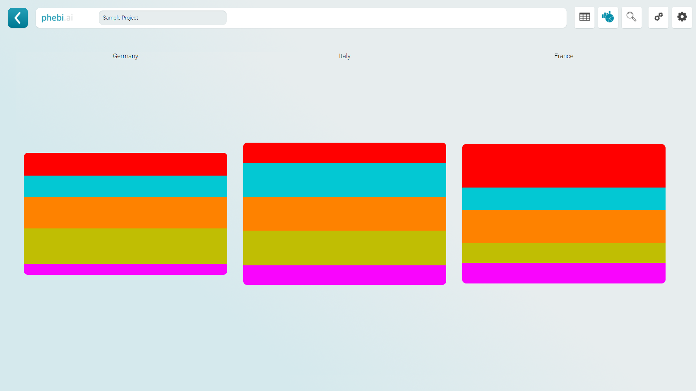

# Phebi Open Charting - Example 1

## 1. How Reports work

In Phebi, a report is a set of defined report elements. In order to create a custom report in Phebi, we have to create a report element that then is referred to in a report definition file.

## 2. Report Definition

The report definition is quite simple. It mainly consists of rows, columns and elements. It will also need a title and a thumbnail image. There are a number of default report elements that can be configured through a set of settings.

A more detailed tutorial how to define reports can be found [here](https://github.com/Phebi-AI/report-definitions).

## 3. HTML

A custom report element runs in the portal in an iframe, giving the programmer complete control of the chart. Phebi will always reference to index.html, so we start by creating that.

index.html
```
<!DOCTYPE html>
<html>
<head>
    <meta charset="utf-8" />
</head>
<body>
</body>
</html>
```

## 4. Phebi Scripts

To align with the Phebi Portal UI, there are two important scripts that can be referenced. 

```
<link rel="stylesheet" type="text/css" href="/core/Core.css" />
<link rel="stylesheet" type="text/css" href="/defaults/Colors.css" />
```

The Core.css applies basic styling, like font-family etc. 
The Colors.css contains default variables of colors and designs used.

To design a white box how it's commonly used in the Phebi Portal you can reference the following variables:

```
<style type="text/css">
  .Box {
    background-color: var(--background2);
    box-shadow: var(--box-shadow);
    border-radius: var(--border-radius);
  }
</style>
```

For a full list of available styling variables, check out the [Colors.css](https://dev.phebi.ai/defaults/Colors.css) file.

## 5. Building the chart

In order to receive data, we need to define two javascript methods on window level. "Render" and "Update"
When the report is loaded, Phebi will call "Render" on window level with two arguments, "data" and "definition". 

The data comes an array of values how they have been defined in the report definition. The definition is a copy of the report definition, passing settings like dimensions etc. etc.

### 5.1 Define the report

Let's start with defining the report and what data we want to receive.

```
{
  "Title": "charting-sample-1",
  "Preview": "data:image/png;base64,iVBORw0KGgoAAAANSUhEUgAAAAEAAAABCAIAAACQd1PeAAAAAXNSR0IArs4c6QAAAARnQU1BAACxjwv8YQUAAAAJcEhZcwAADsMAAA7DAcdvqGQAAAAMSURBVBhXY/j//z8ABf4C/qc1gYQAAAAASUVORK5CYII=",
  "Rows": [
    {
      "height": "auto",
      "Columns": [
        {
          "width": "auto",
          "Elements": [
            {
              "Id": "report1",
              "Type": "SampleReport",
              "Dimension": "Market",
              "GroupBy": "[Market]",
              "Measures": [
                {
                  "Name": "Market",
                  "Value": "[Market]"
                },
                {
                  "Name": "Emotion",
                  "Value": "[Emotion]"
                },
                {
                  "Name": "ERS",
                  "Value": "[ERS]"
                }
              ],
              "Class": "DashboardElement_NoBox"
            }
          ]
        }
      ]
    }
  ]
}
```

In this example we tell the system we want to compare the emotions and ERS-scores in the different markets. Markets is a tag that is attached to every file in the project.

For more detail on how the values and settings are defined check out how [elements are defined within the report definition](https://github.com/Phebi-AI/report-definitions#elements)

Using the sample report definition from above, the data passed to the render and update function, will look like the following:

```
[
    { 
        "Market": "France", 
        "Emotion": [0.8, 0.6, 0.4, 0.3, 0.2], 
        "ERS": { "Score": 0.5, "Positive": 1, "Negative": -1 }
    },
    { 
        "Market": "Italy", 
        "Emotion": [0.8, 0.6, 0.4, 0.3, 0.2], 
        "ERS": { "Score": 0.5, "Positive": 1, "Negative": -1 }
    },
    { 
        "Market": "Germany", 
        "Emotion": [0.8, 0.6, 0.4, 0.3, 0.2], 
        "ERS": { "Score": 0.5, "Positive": 1, "Negative": -1 }
    }
]
```

### 5.2 Create the charting javascript file

Let's create a new javascript file and reference it in the index.html

index.html
```
<!DOCTYPE html>
<html>
<head>
    <meta charset="utf-8" />
    <script type="text/javascript" src="chart.js"></script>
</head>
<body>
</body>
</html>
```

chart.js
```
function Update(data, definition) {
    Render(data, definition);
}

function Render(data, definition) {
}
```

### 5.3 Receiving data and Rendering the report

We can now take the data that has been passed to the script and render the report.

```
function Render(data, definition) {
    // Clear the document body.
    document.body.innerHTML = "";

    var pnlColumn, pnlEmotion, label;
    // Run through all data entries.
    for (var i = 0; i < data.length; i++) {
        // Create a new container element for the market.
        pnlColumn = document.createElement("div");
        pnlColumn.className = "Column";

        // Create a new label to display the market.
        label = document.createElement("div");
        label.className = "Label";

        // It is good practice to always use the dimension defined in the report,
        // instead of referencing directly to "Market".This way the
        // dimension can easily be changed through the report element settings.
        label.innerHTML = data[i][definition.Dimension];

        // Add the label to the market container.
        pnlColumn.appendChild(label);

        // Run through all emotions of the market.
        for (var e = 0; e < data[i].Emotion.length; e++) {
            // Create a new container for the emotion.
            pnlEmotion = document.createElement("div");
            pnlEmotion.className = "Emotion";

            // Set the height to x% of the fifth of the max percentage. x equals the emotion score.
            pnlEmotion.style.height = ((100 / 5) * data[i].Emotion[e]) + "%";
            
            // Assign the predefined color for the
            // emotion to the container as background - color.
            pnlEmotion.style.backgroundColor = "var(--color-emotions-" + e + ")";

            // Add the emotion control to the market container.
            pnlColumn.appendChild(pnlEmotion);
        }
        
        // Add the column control to the document body.
        document.body.appendChild(pnlColumn);
    }
}
```

### 5.4 Styling the report

Let's apply some basic styling, so the columns appear next to each other.

index.html
```
<!DOCTYPE html>
<html>
<head>
    <meta charset="utf-8" />
    <script type="text/javascript" src="chart.js"></script>
    <link rel="stylesheet" href="chart.css" type="text/css" />
    <link rel="stylesheet" href="/core/Core.css" type="text/css" />
    <link rel="stylesheet" href="/defaults/Colors.css" type="text/css" />
</head>
<body>
</body>
</html>
```

chart.css
```
html, body {
    margin: 0px;
    padding: 0px;
    height: 100%;
}

.Column {
    height: 100%;
    margin: 0px 20px;
    min-width: 200px;
    float:left;
}
.Label {
    text-align: center;
}
.Emotion {
    width: 100%;
}
.Emotion_0 {
    border-radius: var(--border-radius-top);
}
.Emotion_4 {
    border-radius: var(--border-radius-bottom);
}
```

## 6. Importing your report definition and custom chart to a project

TBD

## 7. Voila

Your report is now appearing in your project


